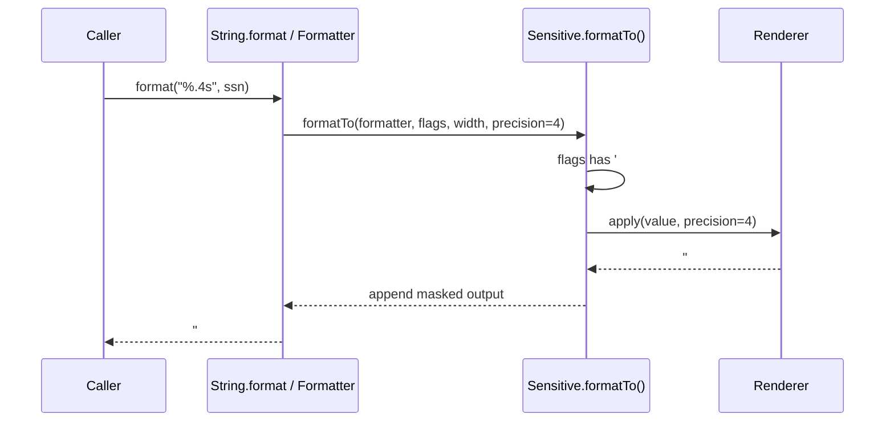
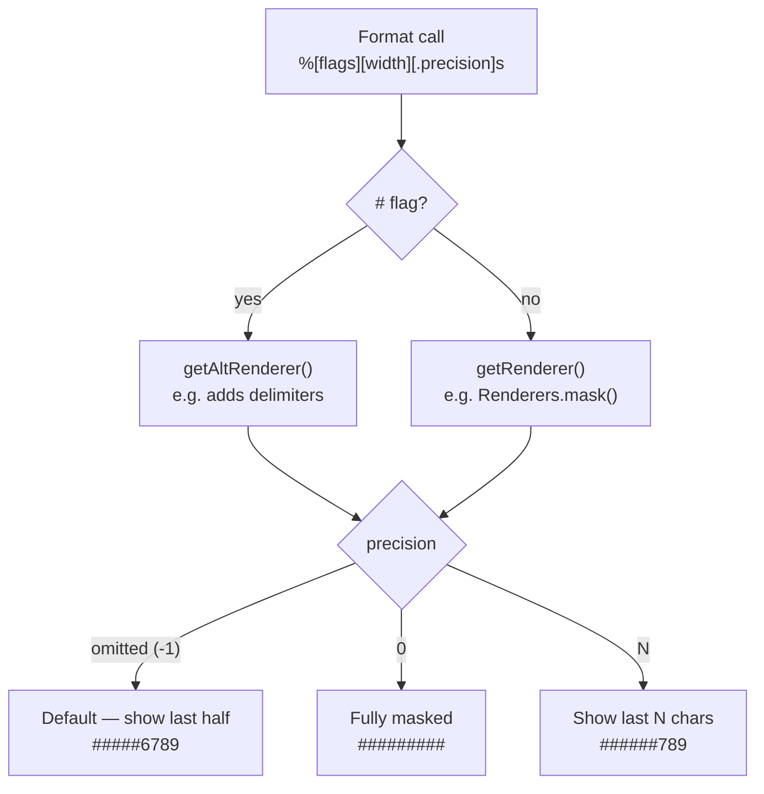
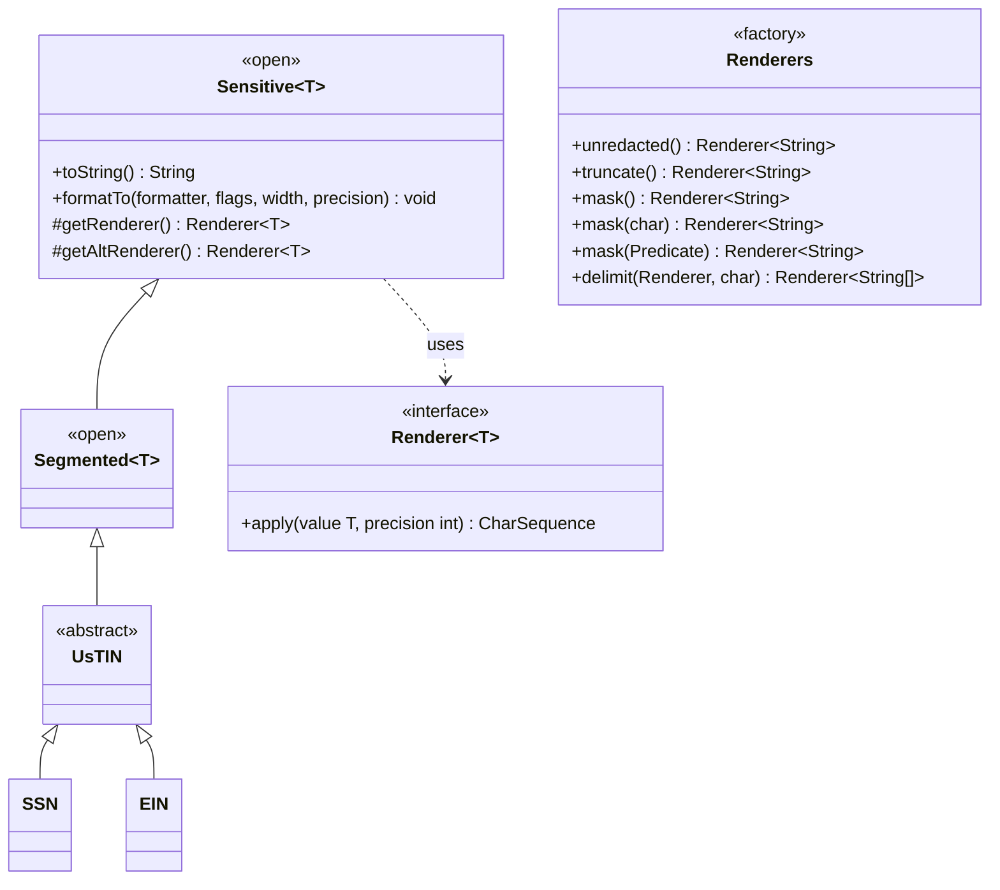

# Sensitive Data Masking

A Java library for protecting sensitive data from inadvertent disclosure through logging, traces, and UI rendering.

## Links

- [GitHub repository](https://github.com/bhanafee/Masking)
- [Javadoc: sensitive](https://bhanafee.github.io/Masking/javadoc/sensitive/)
- [Javadoc: tin](https://bhanafee.github.io/Masking/javadoc/tin/)
- [Apache 2.0 License](https://bhanafee.github.io/Masking/LICENSE)
- [Code of Conduct](https://bhanafee.github.io/Masking/CODE_OF_CONDUCT.html)
- [Claude Code Guide](https://bhanafee.github.io/Masking/CLAUDE.html)

## The Problem

Applications that handle sensitive data such as Social Security Numbers, credit card numbers, and other personally identifiable information (PII) often inadvertently expose this data in logs, stack traces, debug output, or through careless `toString()` invocations. Traditional approaches require developers to remember to mask data at every output point, which is error-prone.

## The Solution

This library provides wrapper types that are **safe by default**. When you wrap sensitive data in a `Sensitive` container, it cannot be accidentally exposed through `toString()` or standard formatting operations. The data is only revealed when explicitly requested with the appropriate precision level.



## Features

- **Safe by default**: `toString()` returns a redacted string, which is empty by default
- **Format-string integration**: Works with `String.format()` and `Formatter` via `java.util.Formattable`
- **Precision-based disclosure**: Control exactly how much data to reveal using format precision (e.g., `%.4s`)
- **Flexible rendering**: Built-in renderers for masking, truncating, and custom redaction strategies
- **Serialization protection**: Prevents accidental serialization of sensitive data
- **Thread-safe**: Immutable design ensures safe concurrent access
- **Extensible**: Easy to create custom sensitive types with custom rendering

## Requirements

- Java 17 or higher (Java 25 toolchain used for compilation)
- Gradle for building

## Installation

The library is split into two artifacts. Add whichever you need to your `build.gradle`:

```groovy
dependencies {
    // Core masking framework only
    implementation 'com.maybeitssquid:sensitive:1.0-SNAPSHOT'

    // US Taxpayer Identification Numbers (pulls in sensitive transitively)
    implementation 'com.maybeitssquid:tin:1.0-SNAPSHOT'
}
```

Or build from source:

```bash
./gradlew build
```

## Quick Start

```java
import com.maybeitssquid.sensitive.*;

// Wrap sensitive data - safe by default
Sensitive<String> secret = new Sensitive<>("my-secret-value");
System.out.println(secret);           // prints "" (empty)
System.out.printf("%s%n", secret);    // prints "" (empty)

// Create a custom sensitive type with masking
public class MaskedSecret extends Sensitive<String> {
    private static final Renderer<String> RENDERER = Renderers.mask();

    public MaskedSecret(String value) {
        super(value);
    }

    @Override
    protected Renderer<String> getRenderer() {
        return RENDERER;
    }
}

MaskedSecret password = new MaskedSecret("password123");
System.out.printf("%s%n", password);     // prints "####rd123" (half masked by default)
System.out.printf("%.4s%n", password);   // prints "#######d123" (show last 4)
System.out.printf("%.0s%n", password);   // prints "###########" (fully masked)
```

## Core Concepts

### Sensitive&lt;T&gt;

The base container class for sensitive data. It implements `Formattable` to integrate with Java's formatting system.

```java
// Basic usage
Sensitive<String> data = new Sensitive<>("secret");

// With custom supplier (for lazy loading or secure storage)
Sensitive<String> lazy = new Sensitive<>(() -> loadFromSecureStore());
```

### Renderer&lt;T&gt;

A functional interface that controls how sensitive data is rendered:

```java
@FunctionalInterface
public interface Renderer<T> {
    CharSequence apply(T value, int precision);
}
```

The `precision` parameter controls how much data to reveal:
- `precision = -1`: Default behavior (typically shows half the data)
- `precision >= 0`: Number of unredacted characters to show



### Renderers Factory

Built-in renderers for common use cases:

```java
// Show value completely unredacted
Renderer<String> plain = Renderers.unredacted();

// Truncate leading characters, show trailing
Renderer<String> truncated = Renderers.truncate();

// Mask leading characters with '#'
Renderer<String> masked = Renderers.mask();

// Mask with custom character
Renderer<String> stars = Renderers.mask('*');

// Selective masking (preserve delimiters)
Renderer<String> selective = Renderers.mask(Character::isDigit);

// Join array segments with delimiter, then render
Renderer<String[]> joined = Renderers.delimit(Renderers.mask(), '-');
```

### Segmented&lt;T&gt;

A `Sensitive` subclass for values composed of multiple segments (like SSNs or phone numbers):

```java
public class PhoneNumber extends Segmented<String> {
    private static final Renderer<String[]> RENDERER =
        Renderers.delimit(Renderers.mask(Character::isDigit), '-');

    public PhoneNumber(String... segments) {
        super(segments);
    }

    @Override
    protected Renderer<String[]> getRenderer() {
        return RENDERER;
    }
}
```

## Format String Reference

| Format | Description | Example Input  | Example Output |
|--------|-------------|----------------|----------------|
| `%s` | Default rendering | SSN            | `#####6789`    |
| `%#s` | Alternate form (with delimiters) | SSN            | `###-##-6789`  |
| `%.Ns` | Show last N characters | `%.3s` on SSN  | `######789`    |
| `%#.Ns` | Alternate + precision | `%#.5s` on SSN | `###-#5-6789`  |
| `%Ws` | Minimum width W | `%12s`         | ` #####6789`   |
| `%-Ws` | Left-justified width | `%-12s`        | `#####6789   ` |
| `%S` | Uppercase | SSN            | `#####6789`    |

## Serialization Protection

By default, `Sensitive` objects **cannot be serialized**. This prevents accidental exposure of sensitive data through:
- Session serialization
- Distributed caches (Redis, Memcached)
- RPC frameworks
- Logging frameworks that serialize objects

```java
Sensitive<String> secret = new Sensitive<>("password");

// This will throw NotSerializableException
ObjectOutputStream oos = new ObjectOutputStream(stream);
oos.writeObject(secret);  // Throws!
```

If you need serialization, use a custom supplier:

```java
// Lambda suppliers ARE serializable (value survives serialization)
Sensitive<String> serializable = new Sensitive<>(() -> "secret");
```

## Built-in TIN Implementations

The library includes ready-to-use implementations for US Taxpayer Identification Numbers:

### Social Security Number (SSN)

```java
import com.maybeitssquid.tin.us.SSN;

// Create from formatted string
SSN ssn = new SSN("123-45-6789");

// Create from segments
SSN ssn2 = new SSN("123", "45", "6789");

// Create from integers
SSN ssn3 = new SSN(123, 45, 6789);

// Formatting examples
String.format("%s", ssn);      // "#####6789" (default masking, no delimiters)
String.format("%#s", ssn);     // "###-##-6789" (masked with delimiters)
String.format("%.3s", ssn);    // "######789" (show last 3)
String.format("%#.3s", ssn);   // "###-##-#789" (show last 3 with delimiters)
```

### Employer Identification Number (EIN)

```java
import com.maybeitssquid.tin.us.EIN;

// Create from formatted string
EIN ein = new EIN("12-3456789");

// Create from segments
EIN ein2 = new EIN("12", "3456789");

// Formatting examples
String.format("%s", ein);      // "#####6789"
String.format("%#s", ein);     // "##-###6789"
String.format("%.5s", ein);    // "####56789"
String.format("%#.2s", ein);   // "##-#####89"
```

## Creating Custom Sensitive Types

### Simple Custom Type

```java
public class ApiKey extends Sensitive<String> {
    private static final Renderer<String> RENDERER = Renderers.mask('*');

    public ApiKey(String key) {
        super(key);
    }

    @Override
    protected Renderer<String> getRenderer() {
        return RENDERER;
    }
}
```

### With Alternate Rendering

```java
public class CreditCard extends Sensitive<String> {
    private static final Renderer<String> MASKED = Renderers.mask();
    private static final Renderer<String> TRUNCATED = Renderers.truncate();

    public CreditCard(String number) {
        super(number);
    }

    @Override
    protected Renderer<String> getRenderer() {
        return MASKED;  // Default: ########12345678
    }

    @Override
    protected Renderer<String> getAltRenderer() {
        return TRUNCATED;  // Alternate (%#s): 123456789
    }
}
```

### Segmented Type

```java
public class PhoneNumber extends Segmented<String> {
    private static final Renderer<String[]> RENDERER =
        Renderers.delimit(Renderers.mask(Character::isDigit), '.');

    public PhoneNumber(String areaCode, String exchange, String subscriber) {
        super(new String[]{areaCode, exchange, subscriber});
    }

    @Override
    protected Renderer<String[]> getRenderer() {
        return RENDERER;
    }
}

PhoneNumber phone = new PhoneNumber("555", "123", "4567");
String.format("%.4s", phone);  // "###.###.4567"
```

## Module Structure

Two JPMS modules published as separate artifacts:



```
com.maybeitssquid:sensitive        artifact: com.maybeitssquid.sensitive
├── Sensitive<T>                   # Base container class
├── Segmented<T>                   # Array-backed sensitive data
├── Renderer<T>                    # Rendering interface
└── Renderers                      # Factory for common renderers

com.maybeitssquid:tin              artifact: com.maybeitssquid.tin
│   requires com.maybeitssquid.sensitive
├── TIN<I>                         # Base TIN interface
├── NationalTIN                    # National TIN interface
├── InvalidTINException            # Validation exception
└── us/                            # US implementations
    ├── UsTIN                      # US TIN base class
    ├── SSN                        # Social Security Number
    └── EIN                        # Employer Identification Number
```

## Thread Safety

All classes in this library are designed to be thread-safe:

- `Sensitive` and `Segmented` are immutable once constructed
- `Renderer` implementations are stateless
- `Renderers` factory methods return shared instances

Ensure that any custom `Supplier<T>` implementations are also thread-safe.

## Best Practices

1. **Define renderers as static constants** to avoid creating new instances:
   ```java
   // Good
   private static final Renderer<String> RENDERER = Renderers.mask();

   // Bad - creates new renderer per call
   protected Renderer<String> getRenderer() {
       return Renderers.mask();  // Don't do this!
   }
   ```

2. **Make sensitive type classes `final`** to prevent subclasses from exposing data

3. **Never override `toString()`** in `Sensitive` subclasses - it's final for a reason

4. **Use precision sparingly** - only reveal data when absolutely necessary

5. **Consider alternate forms** for human-readable output while keeping default output safe
